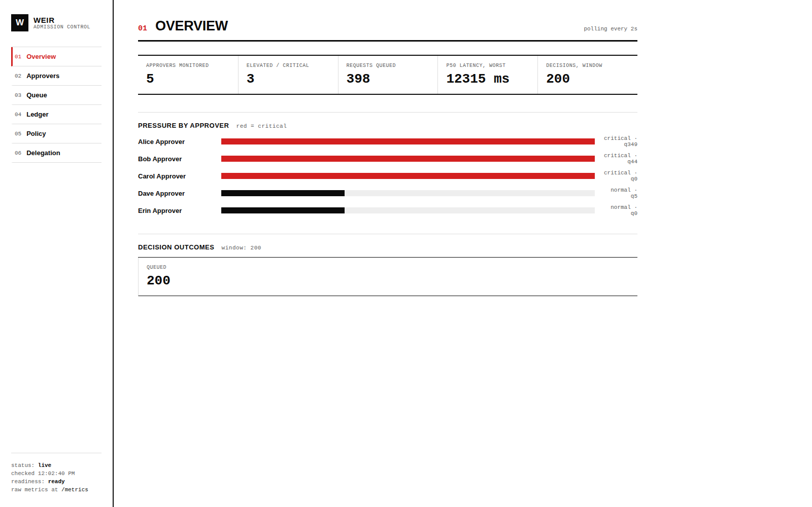
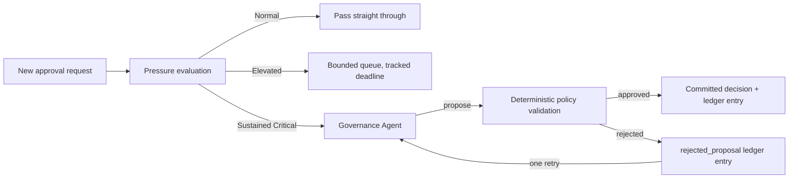
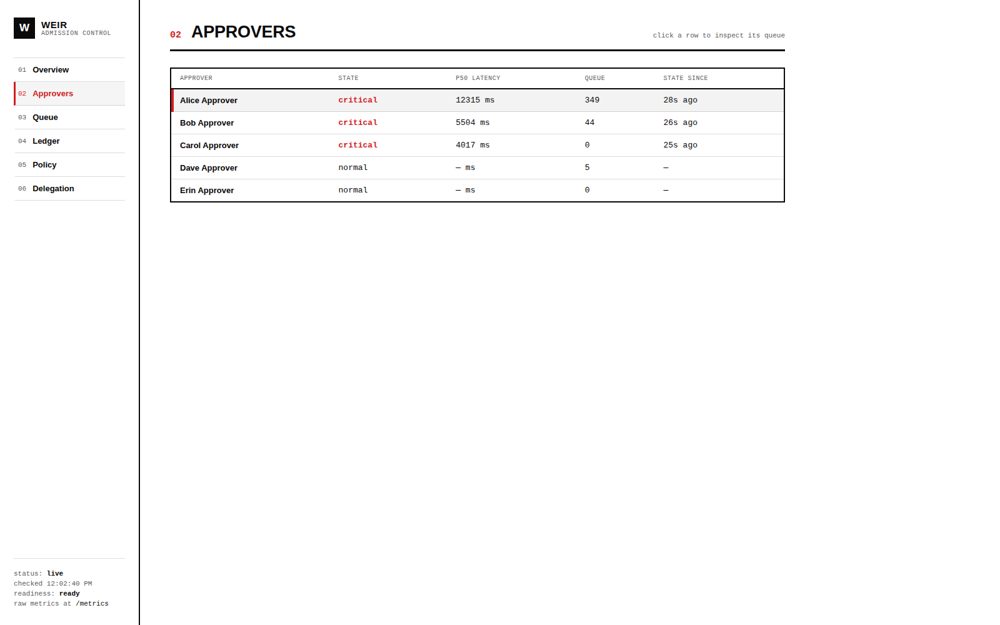
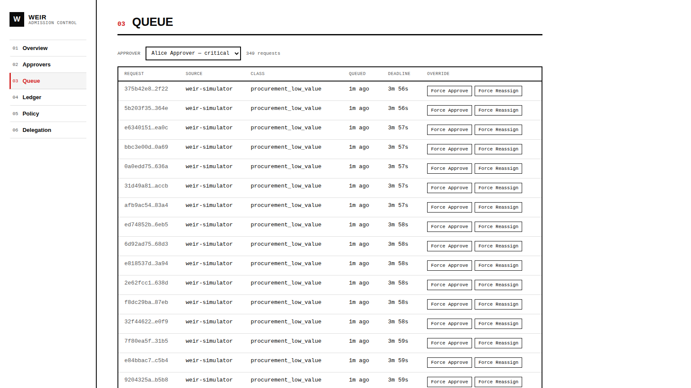
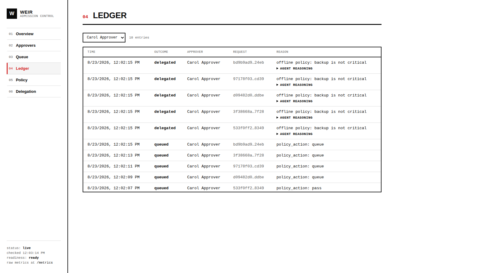

# Weir

**Production-minded admission control for human approvers.**

Weir treats an overloaded approver the same way a distributed system treats an overloaded backend: watch its live latency, apply backpressure with a bounded queue, and — if the overload is sustained — delegate or auto-approve under a hard, auditable policy instead of letting requests silently rot in an inbox.

[](https://www.python.org/)
[](https://fastapi.tiangolo.com/)
[](#running-the-tests)
[](LICENSE)

<p align="center">
  
</p>

<p align="center"><sub>Live screenshot: three approvers under real synthetic load, driven entirely by <code>scripts/simulate_requests.py</code> against the actual FastAPI backend below — nothing in this README is mocked.</sub></p>

---

## The problem

Every enterprise approval tool — procurement sign-off, expense approval, access requests, contract review — treats a slow approver as an inbox-design problem. Better notifications. Smarter routing. A nicer dashboard.

None of that addresses the actual failure mode: **an approver is a finite-capacity resource with a measurable decision-latency curve** — functionally identical to a GPU with a finite KV-cache serving inference requests. When they're oversubscribed, requests don't fail loudly. They silently pile up, latency creeps up for everyone waiting behind them, and nobody has a signal that it's happening until someone escalates in frustration.

Weir is an admission-control layer that sits in front of any approval-driven workflow and governs load the way a capacity-aware proxy governs traffic to a constrained backend: live pressure signal, bounded queueing, and — only under sustained overload — delegation or constrained auto-approval, with every intervention logged and explainable.

## How it works



Each approver's pressure state — **Normal → Elevated → Critical** — is computed from a rolling window of decision-latency samples, with consecutive-sample requirements and hysteresis so one noisy reading doesn't flip the state back and forth. Two signals feed that window: the *real* one (how long a request actually took to get decided, once it's resolved) and a *live* one (how long the oldest thing still sitting in the queue has already been waiting) — the second is what lets pressure climb visibly from backlog alone, which matters because a demo — or a real incident — can't wait around for decisions to complete before the system notices something is wrong.

The **Governance Agent** only gets involved once pressure is genuinely sustained in Critical. It runs in one of two modes:

- **Offline** (default, zero external dependencies) — a deterministic policy stand-in: auto-approve low-risk requests under their configured value threshold, delegate everything else to a backup approver who isn't also critical, escalate to a human if no safe backup exists.
- **Live** (`WEIR_AGENT_MODE=live`) — the same decision space, reasoned over by Claude with a small tool set (`get_approver_pressure`, `get_queue_state`, `get_backup_approvers`, `get_policy`, `get_recent_decisions` to read; `propose_delegate`, `propose_auto_approve`, `propose_escalate_to_human`, `propose_hold` to act).

**The agent never writes to the ledger and never mutates approval state.** Every proposal — from either mode — passes through the same deterministic `policy_engine.validate_proposal`, which checks risk tier, value threshold, delegation-chain legality, and an hourly auto-approval rate limit. A rejection isn't discarded: it's logged as a first-class `rejected_proposal` ledger entry, gets exactly one constrained retry, and stays visible in the dashboard as "agent proposed X, policy said no" — the strongest available answer to "why should I trust this."

## Quickstart

```bash
git clone https://github.com/VampiricCyborg/Weir.git
cd Weir
python3.13 -m venv .venv
source .venv/bin/activate          # Windows: .venv\Scripts\Activate.ps1

pip install -e ".[dev]"            # add "live" too if you'll use WEIR_AGENT_MODE=live
python scripts/seed.py             # 5 approvers, 3 reciprocal backup pairs, 3 request classes
uvicorn main:app --reload --port 8080
```

Open **http://localhost:8080** — the dashboard is served directly by the API, no separate frontend build.

In a second terminal, make one approver visibly overloaded:

```bash
python scripts/simulate_requests.py \
  --approver-email alice.approver@example.com \
  --ramp --rate 4 --duration 60
```

Ramp mode never simulates the approver actually deciding anything — the queue is meant to visibly build. Within a few seconds you should see Alice's pressure move Normal → Elevated → Critical on the dashboard, her queue depth climb, and — once Critical — the decision ledger start filling with real `delegated` and `auto_approved` entries as the governance agent kicks in.

### Running the tests

```bash
pytest
```

10 tests, covering the deterministic policy engine (pressure ramp/hysteresis, proposal validation, rate limiting) and the full request lifecycle end to end through the real FastAPI app (queue/approver consistency on every terminal decision, delegation actually moving a request to its backup, pressure genuinely rising from backlog, sustained-critical pressure genuinely producing an auto-approval).

## Watching it work

<p align="center">
  
</p>

Every approver's live pressure state, p50 decision latency, and queue depth, at a glance — click a row to inspect that approver's queue.

<p align="center">
  
</p>

The bounded queue for one approver, with live deadline countdowns and manual **Force Approve** / **Force Reassign** overrides — both admin-key-protected, and both write through the same latency/queue bookkeeping as an automated decision, so the dashboard never drifts from reality no matter who (or what) resolves a request.

<p align="center">
  
</p>

The decision ledger, filtered to one approver — every automated `delegated` decision here carries expandable agent reasoning, so "why did this happen" is always one click away.

## API surface

**Requests**

```http
POST /v1/requests
{
  "source_system": "procurement",
  "external_ref": "po-123",
  "request_class": "procurement_low_value",
  "approver_email": "alice.approver@example.com",
  "payload": {"amount": 420, "currency": "USD"}
}
```
```json
{"request_id": "...", "status": "queued", "pressure_state": "normal", "estimated_wait_seconds": 300}
```

**Approvers & queues** — `GET /v1/approvers`, `GET /v1/approvers/{id}/status`, `GET /v1/approvers/{id}/queue`

**Decision ledger** — `GET /v1/decisions/recent?limit=&offset=&approver_id=`, `POST /v1/decisions/{request_id}/override` *(requires `X-Admin-Key`; rejects an already-resolved request with 409 instead of double-logging)*

**Policy config** — `GET /v1/config/policy`, `PUT /v1/config/policy` *(requires `X-Admin-Key`; validates risk tier and positive/non-negative values)*

**Operations** — `GET /healthz`, `GET /readyz`, `GET /metrics` *(Prometheus text: pressure gauge, queue-depth gauge, and decision counters per approver)*

## Configuration

```dotenv
WEIR_DATABASE_URL=sqlite:///./data/weir.db
WEIR_AGENT_MODE=offline                        # or "live" (+ ANTHROPIC_API_KEY)
WEIR_ADMIN_API_KEY=dev-admin-key
WEIR_THRESHOLD_ELEVATED_MS=1000
WEIR_THRESHOLD_CRITICAL_MS=3000
POLICY_STATE_CONSECUTIVE_SAMPLES=2
POLICY_STATE_HYSTERESIS_PCT=10
POLICY_STATE_COOLDOWN_SECONDS=60               # gates recovery only — worsening pressure is never delayed
WEIR_AUTO_APPROVE_RATE_LIMIT_PER_HOUR=10
WEIR_AGENT_REINVOKE_SECONDS=45                 # re-run the agent on this cadence while sustained critical
```

### Default seeded policy

| Request class | Max wait | Auto-approve under | Risk tier |
|---|---:|---:|---|
| `procurement_low_value` | 300s | 1000 | low |
| `procurement_high_value` | 1800s | disabled | high |
| `access_request_standard` | 600s | disabled | medium |

## Fail-open, by design

Weir is built so a state-store or agent outage degrades gracefully instead of turning into an approval outage:

- An unavailable governance agent produces zero proposals and writes zero decisions — it fails open, logged, and the deterministic queue path continues unaffected.
- Every rejected proposal is a first-class, visible ledger entry, not a silent drop.
- Timed-out queue entries get an explicit `timed_out` decision the moment their deadline passes.
- Delegation is only ever legal to the approver's configured backup (agent path); the manual admin override can reassign anywhere, since a human is already vouching for it.

## Repository layout

```text
app/
  db.py                 SQLAlchemy models, TERMINAL_STATUSES, session setup
  state_store.py         Async in-process store: latency windows, pressure state,
                          deadline-ordered queues -- shaped to swap in Redis later
  policy_engine.py        Deterministic, readable state machine: pressure eval,
                          admission action, proposal validation
  governance_agent.py     Proposal-only agent -- offline stand-in + live Claude mode
  orchestrator.py         Wires agent proposals -> validation -> ledger -> queue,
                          consistently, whether the proposal is committed or rejected
  routers/                request / approver / decision / config / ops APIs
  tests/                  10 tests: policy engine + full-stack lifecycle
dashboard/static/         Single-page dashboard: plain HTML/CSS/JS, no build step
scripts/                  seed.py, simulate_requests.py
weir-demo/                Standalone client-side (Vite/React) presentation demo --
                          simulates the same pipeline in-browser, no backend needed
main.py                   FastAPI app + router/static wiring
```

## Current architecture and roadmap

The current implementation keeps the core policy path small and easy to run locally. These boundaries are deliberate starting points, with the following hardening work planned:

- **Postgres backend** for production durability, concurrency, and migrations beyond the current SQLite setup.
- **Redis state store** so pressure and queue state can be shared across replicas instead of living in one process.
- **Authentication and authorization** for admin endpoints, including SSO integration and scoped operator roles.
- **Production dashboard** with richer navigation, deployment-ready asset builds, and operational configuration.
- **More connectors and deployment guidance** for integrating with approval systems such as procurement, access management, and service desks.

The policy engine is deliberately *not* a rules DSL or an opaque service — it's plain, readable Python, on purpose. Explainability is the actual product; a black-box policy engine would defeat the point.
